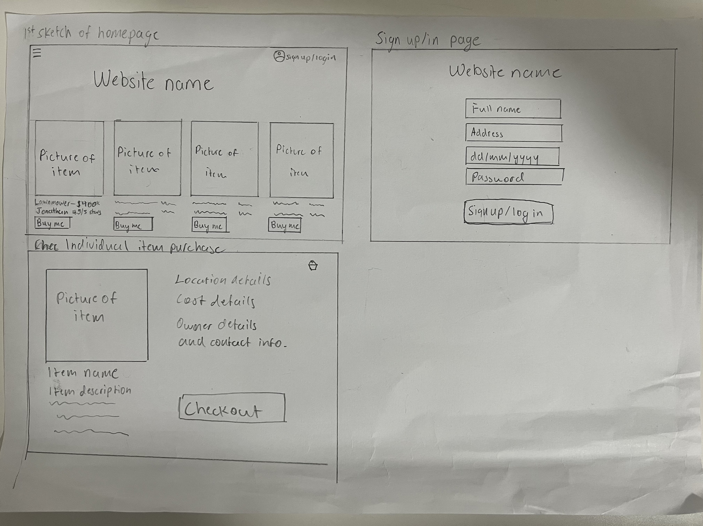

# Project definition
My web application social network will be a platform where people are able to loan out items to other people and you can rent these items from them. The homepage is where the user should be able to browse through a few items that will show basic detial like the item, location of the person, name. Some of these items include things like electrical drills, lawnmowers, hedgetrimmers, and the price of rent per week should also be clearly listed where the user is able to see  There will also be a button on that item that says something like rent me, where when the user presses on it will bring them to a form that will ask for the user's details such as their name, address, contact detials, and how long they inted to rent the item for. 
# Functional and non-functional requirments
## Functional:
- User should be able to browse through a few items and look at the detail of them
- User should be able to go to a form asking for their details
- User should be able to log in with their username and password
## Non-functional:
- The website should run smoothly 
- The website should be able to switch between the homepage and the form page smoothly 
# First wireframe sketch

# Alternate wireframe design

