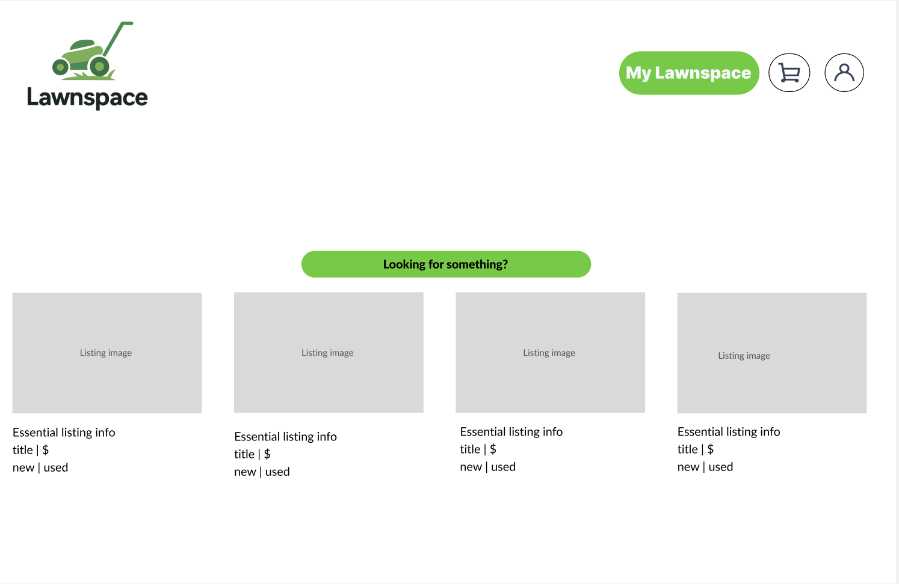
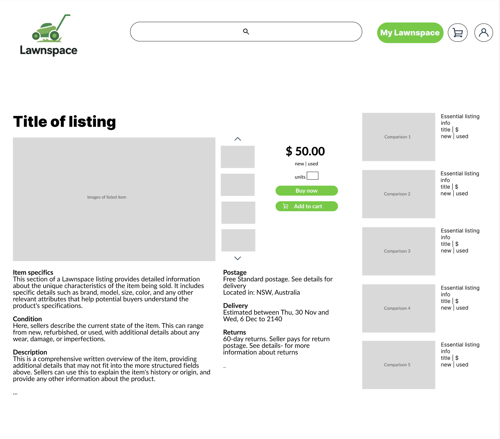
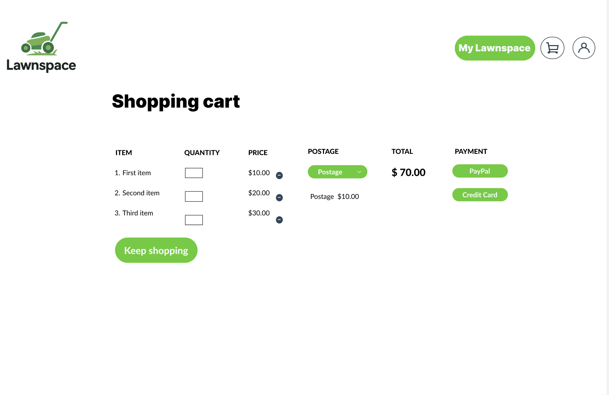
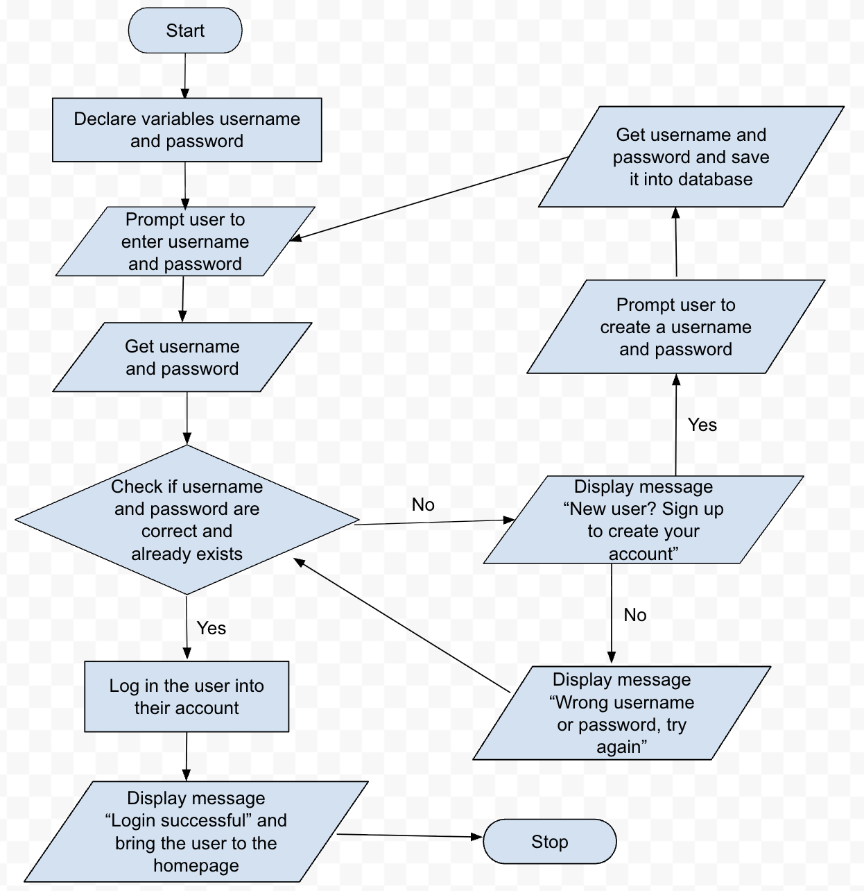
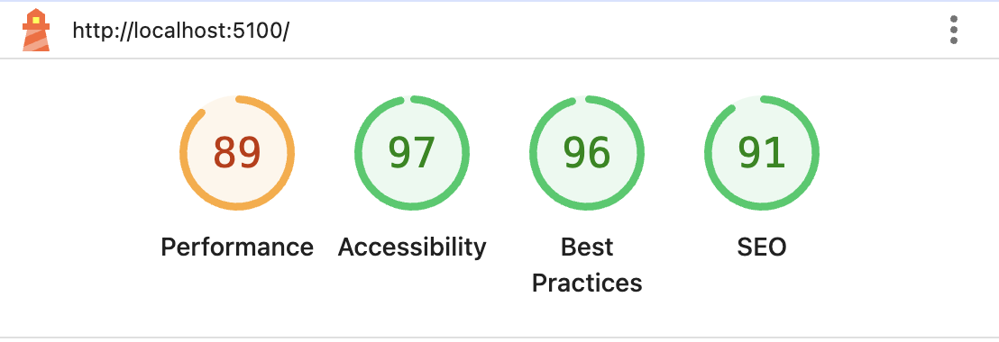

# Project definition
My web application social network will be a platform where people are able to sell or buy new or used items to other people but more specifically tools for a lawn, backyard or hardwware specfici stuff. The homepage is where the user should be able to browse through a few items that will show basic detial like the item, location of the person, name. Some of these items include things like electrical drills, lawnmowers, hedgetrimmers, and the price of the item  should also be clearly listed where the user is able to see  There will also be a button on that item that says something like read more, where when the user presses on it will bring them to another page and show the user more specific details about the item. And on that page you can press a button that leads you to the checkout where the user can purchase the items. 
# Functional and non-functional requirments
## Functional:
- User should be able to browse through a few items and look at the detail of them
- User should be able to look at specific details about the listing of an item
- User should be able to log in with their username and password
- User should be able to add things to their bag and be shown it on the checkout page
## Non-functional:
- The website should run smoothly overall
- The website should be able to switch between the each page quickly
- The website should respond to user interaction within 2 seconds
# First wireframe sketch

# Alternate wireframe designs

# Designing Algorithms
## Algorithm design

## Test cases 
| Test Case Scenario              | Test Steps                                                                 | Expected Result                                                                                      | Actual Result |
|---------------------------------|----------------------------------------------------------------------------|------------------------------------------------------------------------------------------------------|---------------|
| User has correct login and password | 1. Open login page   2. Enter correct username and password                 | User is logged in and redirected to the homepage logged in as their user                             | N/A           |
| User has wrong login or password   | 1. Open login page   2. Enter incorrect username or password               | A message is displayed that says “Wrong username or password, try again” and the user is prompted to enter their details again | N/A           |

# Google Lighthouse Report 

# Weekly Logs

## Week 5
- Set up my development environment in VS Code following the SET-UP document  
- Downloaded Python, pip, and all the necessary extensions as per the document  
- Set up all the files and folders necessary for my development environment  

## Week 6
- I started to create the necessary tables for my databases  
- I put a little bit of test data in it and just played around with it  
- I created some SQL queries to show my client in our meeting  

## Week 7
- Started working through the document to put some HTML and CSS in it  
- Managed to get the server running and render one page  
- ChatGPT helped me fix it so that it could render multiple pages  

## Week 8
- Styled my homepage, adding the colours for the background  
- Finished formatting my website and styling all the pages  
- Fixed up the header and layout of the web application  

## Week 9
- Managed to add images to it like the logo and on the homepage  
- Ran a Google Lighthouse report on the web app  
- Started working on adding simple sign-up and log-in pages  

## Week 10
- Simple sign-up and log-in pages working  
- Formatted the sign-up and log-in to make them look better  
- Ran test cases with my client — signing in working, yay!  

## Week 1
- Fixed bugs with the homepage not showing up properly  
- Finished all the pages and made sure they work  
- My client did the final user testing of my web application  

# Instructions to run
Download the files. Load into vs code. Run flask. Run python main.py 

# Acknowledgments 
I used the template by Ben Jones that was given to me by Mr Clark. I used figma to get the designs. I used ChatGPT to help me code some stuff and fix some bugs. 
